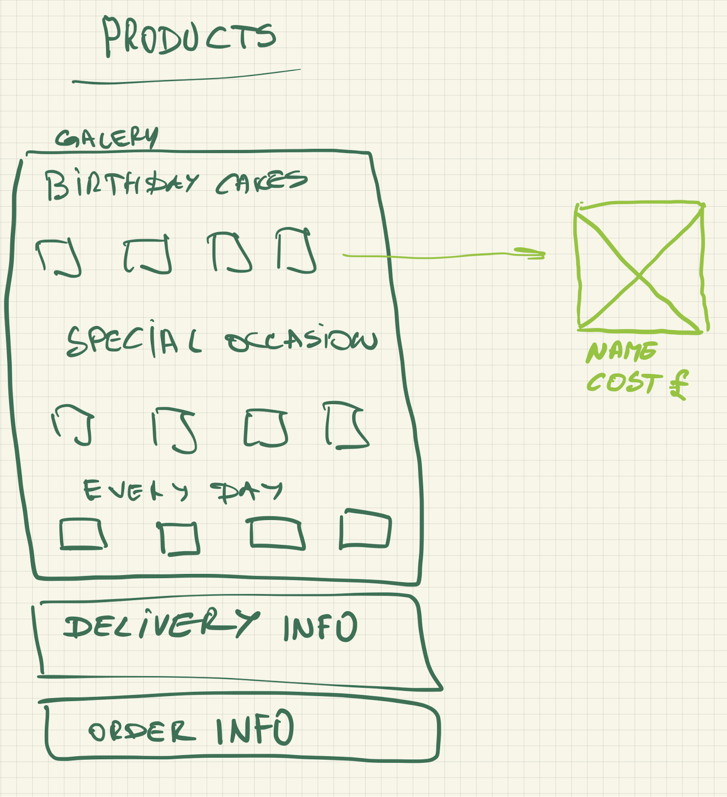
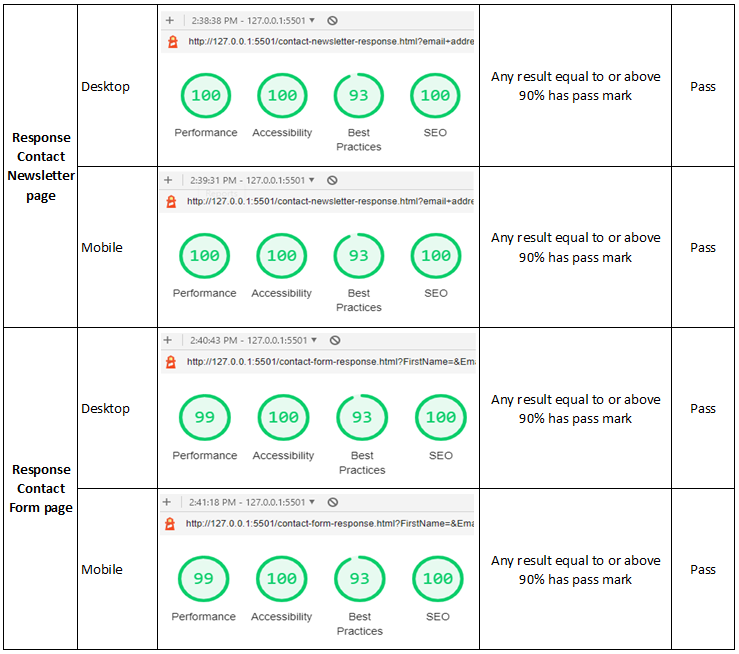

# **Project Overview**

[VikBerry Cakes](https://aleksandratr.github.io/vikberry-cakes/index.html) is a website that is designed for a homemade cake business. The website provides information about the business, its products, and means of contact.

---

## **Table of contents**
* [Project overview](#Project-Overview)
* [Table of contents](#table-of-contents)
* [Project Planning](#Project-Planning)
* [Website colour palette](#Website-colour-palette)
* [Typography](#Typography)
* [Main features](#Main-Features)
* [Navigation Bar](#Navigation-Bar)
* [Footer](#Footer)
* [Home Page](#Home-Page)
* [Products Page](#Products-Page)
* [FAQ Page](#FAQ-Page)
* [Contact Page](#Contact-Page)
* [Bugs Section](#Bugs-section)
* [Deployment](#deployment)
* [Technology](#technology)
* [Credits](#credits)

---
## **Project Planning**

### **Target Audiences**

The largest segments of the target market for a cake business are people who need a cake for a birthday and people who need a cake for a wedding. In both these cases, customers look for custom-made cakes that are both special and unique.

### **Website business goals**

- Provide information about the business.
- Showcase the products.
- Strengthen the brand of the company by extending its    online presence.
- Appear in Google search if somebody is looking for a homemade cake to order.
- Provide a means of connecting with a potential client.
- Share news about products, stories, sales etc._

### **Business owner user stories**

As the business owner of VikBerry Cakes, I want to showcase my cake-making skills and attract customers looking for unique and tasty cakes for their special events. The website should allow me to:
- Simple layout that is easy to read and simple to navigate working on various devices, including mobiles, tablets, and desktops.
- Display a visually appealing homepage that represents the brand.
- Create and manage product displays.
- Upload high-quality images of the cakes, along with descriptions and pricing information.
- Provide a contact page where potential customers can reach out for inquiries and cake orders.
- Receive notifications when customers submit inquiries or place cake orders.
- Ability to update customers on new cake designs, seasonal promotions, and any changes in pricing or availability.
- Send customers promotional offers.
- Monitor website traffic and gather insights about customer preferences and popular cake designs.

### **Business owner content requirements**
- Business logo
- Information about business operations
- Business contact details
- Product information
- Product photos

### **Website User Story**
As a user visiting the VikBerry Cakes website, I want to explore the available cake options and easily order a cake that matches my requirements. The website should allow me to:
- Access a visually appealing homepage overviews the cake business and showcases featured cake designs.
- Browse through different cake categories, such as birthday, wedding, and custom cakes.
- View detailed information about each cake, including images, descriptions, available sizes, and pricing.
- Add a cake to my cart and specify any customization options, such as flavour, frosting, or decorations.
- Provide my contact information and delivery details during the checkout process.
- Receive a confirmation email after placing an order, including an order summary and estimated delivery time.
- Contact the cake business directly via the provided contact information for any inquiries or special requests.
- Share my feedback and rate the cakes or overall experience through a customer review system.

### **Requirements revision**
Several constraints have been identified during the client discussion of the user stories requirements. It was mainly based on the client's limited product content availability and budget. Some of the features were left out and suggested for future development. 

### **The client agreed minimally viable product**
- Home page
- Products
- FAQ
- Contact

Additional pages were added to provide feedback to the user. These pages are:
- Newsletter response page
- Form response page
- 404 Page Cannot Be Found error message page

### **Suggested future improvements**
- Create and manage different categories of cakes, such as birthday cakes, wedding cakes, and custom cakes.
- Ability to make orders online
- Ability to rate products and provide feedback
- Blog page with inspirational cakes suggestions

### **Wireframes**
High level website design-  

Home page -  

Home page mobile latest design -  

Product page -  

Contact page -  

### **Website colour palette**
The colour scheme inspiration comes from researching famous desert brands such as Baskin and Robins, Friers, and Lindt. 

### **Typography**
For the website design, several fonts are used:
All Headings are set to "Playfair Display" Google font, a part of the serif family that uses strokes at the edges of the letters creating a sense of elegance and formality.
All links and buttons are set to "Roboto", part of the sons-serif family. The font was chosen following research on the most readable font family for buttons and labels.
All paragraph text uses Lato Google font, a part of the sans-serif family that provides a clean, modern look.

---
## **Main Features**
The website has four pages - Home, Products, FAQ, and Contact. The layout of the pages is consistent throughout and includes:
- A navigation bar.
- A website's main section.
- A footer with social media and contact page links.

The navigation bar and footer repeat on all pages. 

The design is responsive on all pages providing usability on different screen size devices.

### **Navigation bar**
It is built to provide users with easy and consistent access to the website pages. 

The Navigation bar consists of the following:
- Business logo
- Links to the website pages

Business logo features:
- It displays a cupcake that provides a relation to the business nature.
- It matches the website's colour scheme and therefore blends natively.
- It's a clickable link set to the Home page.
- Logo size gets smaller on small-screen devices.

Navigation bar links features:
- Users are provided with access to all website pages.
- The text is in uppercase to be clear and easier to read.
- Each link has a title attribute for user agents, including assistive  technology.
- The current page link is underlined to inform the user of the location.
- The navigation bar transforms to the "hamburger" menu symbol on the smaller screen displays to reduce the header's size, leaving space for the main content.

Desktop view -   

Mobile device collapsed view -  

Mobile device expanded view -  

### **Footer**
The footer's position is fixed at the bottom of the screen regardless of scrolling. It's built to encourage users to signup for the newsletter, follow social media and provide easy business contact through the WhatsApp messaging platform.

The footer consists of the following:
- Sign Up button.
- Links to business Facebook and Instagram accounts.
- WhatsApp business contact symbol-button.

The footer features:
- Sign up button takes users to the contact page, where they can signup for the business newsletter, which will include information about new products, current offers, and ideas for celebrating occasions.
- Social media links allow users to follow the business page and see business activity, posts, comments and reviews, ensuring trust and giving a personal touch.
- WhatsApp link provides users an easy way to get in touch with the business.

Desktop view -   
Mobile device view -  

---
### **Home page**
The home page consists of the following:
- [Navigation bar](#Navigation-bar)
- Hero image
- Customers reviews
- [Footer](#Footer)

Hero image features:
- Tells users about the nature of the business and location.
- Invites users to see the products.
- Provides a link to the Products page.

Desktop view -   
Mobile device view -  

Customers review features:
- Provides users with an overview of recent customer reviews.
- Creates a feeling of trust and forms a positive expectation for the business.

Desktop view -   
Mobile device view -  

---
### **Products page**
The products page provides information about the business offers and displays individual products.

The Products page consists of the following:
- [Navigation bar](#Navigation-bar)
- Introduction text
- Products display
- [Footer](#Footer)

Introduction text features:
- It tells users what VikBerry Cakes has to offer.
- Provides a link to the Frequently Asked Questions (FAQ) page.

Desktop view -   

Mobile device view -  

Products display features:
- Provides users with an overview of products for offer.
- Provides product indicative cost.
- It gives users the ability to choose from a range of products.
- The range of products provides ideas for custom cakes.

Desktop view -   

Mobile device view -  

---
### **FAQ page**
The Frequently Asked Questions (FAQ) page provides users with information about orders, products etc.

The FAQ page consists of the following:
- [Navigation bar](#Navigation-bar)
- FAQ section
- [Footer](#Footer)

FAQ section features:
- Questions and answers give users basic information on the order processes, product information, and other helpful information.

Desktop view -   

Mobile device view -  

---
### **Contact page**
The Contact page allows users to sign up for newsletters and send inquiries to VikBerry Cakes.

The Contact page consists of the following:
- [Navigation bar](#Navigation-bar)
- Newsletter subscription
- Contact Us information
- Contact form
- [Footer](#Footer)

Newsletter subscription features:
- It provides users to subscribe to the business's newsletters

Desktop view -   

Mobile device view -  

Contact Us information features:
- It invites users to get in touch with VikBerry Cakes
- Provides a link phone number as alternative form of contact.

Desktop view -   

Mobile device view -  

Contact form features
- It allows users to contact the VikBerry Cakes team by sending a message.

Desktop view -   

Mobile device view -  

---

### **Newsletter response page**
The page is a copy of the contact page with feedback information that confirms the user subscribed to the newsletter.

Desktop view -   

Mobile device view -  

### **Form response page**
The page is a copy of the contact page with feedback information that confirms the user submitted the form.

Desktop view -   

Mobile device view -  

### **404 error page**
The page has the same layout as other pages with main element dedicated to the error message.

Desktop view -   

Mobile device view -  

---
## **Testing Phase**
Manual testing is to be undertaken to check the functionality of the designed website. The test covers the following areas - 
- Responsiveness
- Browser compatibility
- Lighthouse
- Code Validation
- User Stories
- Features

### **Responsiveness**
The website has been designed and built to be responsive to cater to various screen-size devices. The test procedures are as follows:
1. Open project in DevTools
1. Check responsiveness for three screen sizes:
    * Desktop (1300px wide screen)
    * Tablet (912px wide screen)
    * Mobile device (320px wide screen)
1. For each screen size, undertake the following checks:
    *   Check text is clearly displayed
    *   Check images layout
    *   Check if the rendering is as per the design
    *   Report the results

#### **Responsiveness test results**
Tests were undertaken in the Chrome browser (by Google) using in-built developer tools. The date of the test is 31/07/2023.

Desktop (1300px wide screen)  

Tablet (768px wide screen)  

Mobile device (320px wide screen)  

#### **Browser compatibility test results**
The website has been tried on various browsers to check its functionality. The following browsers have been used:
- Safari.
- Chrome.
- Edge.

The test procedures are as follows:
- Open the webpage in the chosen browser.
- Check all links on the webpage.
- Check the appearance of the page
- Subscribe to the newsletter.
- Submit form.

The date of the test is 23/07/2023. The results are as follows:

#### **Bugs section**
During the website development, there were numerous bugs found and fixed. These were:
- Missing closing tabs were fixed by adding the element's closing tag.
- Incorrect class names in HTML and CSS files were fixed by copying/pasting the names to the required places.
- Accidentally deleted semicolons in CSS property values were fixed by adding them back.
- Incorrect attribute tags and values were fixed by correcting them.
- Improperly nested elements were fixed by ensuring the correct nesting of elements.
- The footer height was too big for a mobile landscape view.  

The fix was to redesign the footer to reduce its size.
photo. 

- The footer social media icons had an unexpected list view and wrong location. (it should have been to the right of the viewport, not in the middle)  

- To fix the unordered list view, the icon's unordered list display mode has been changed to flex.
- To fix the location, the footer container display has been set to flex, and the footer items spacings are done using flex property justify-content: space-between;  

The form text input window was too small, making inputting text difficult for users.  

It was fixed by by setting the textarea minimum height.  

#### **Lighthouse test**
Lighthouse is an automated tool for improving web page quality, including performance, accessibility, and SEO audits. It's a feature that is built into the DevOps tool. Each website page is tested using the lighthouse tool. 

The test procedures are as follows:
- Open a webpage in a Chrome browser.
- In the developer tool, select Lighthouse.
- Select the following categories:
    - Performance
    - Progressive Web App
    - Best Practices
    - Accessibility
    - SEO
- Run tests for devices:
    - Mobile
    - Desktop

The date of the test is 31/07/2023. The results are as follows: 

#### **HTML validator test**
The website has been checked in W3C HTML Validator. It is a free online tool to verify HTML document syntax and compliance with W3C specifications and standards. 

The test procedures are as follows:
- Open W3C HTML Validator.
- Load required HTML file.
- Undertake check.
- Repeat for all pages.
- Report the results.

The date of the test is 31/07/2023. The results are as follows:

#### **CSS validator test**
The website has been checked using CSS validation service, which verifies web developers' CSS code against W3C specifications, ensuring consistent and correct application across different browsers and devices and ensuring valid syntax and standards.

The test procedures are as follows:
- Open jigsaw CSS Validator.
- Load the required CSS file.
- Undertake check.
- Report the results

The date of the test is 31/07/2023. The results are as follows:

#### **Features test**
All the features were tested as part of the responsive and web browser compatibility tests - no issues to report.

#### **User stories test**
The website has been checked against business and user stories. The results are as follows:

---
## **Deployment**
The website is deployed on GitHub following the below steps:
- Go to my GitHub repository's "Settings" tab.
- Scroll down to the "GitHub Pages" section.
- Under "Source," choose the branch (e.g., "main") from which to deploy my website.
- Click "Save" to enable GitHub Pages for my repository.

GitHub Pages will now build and deploy the website. Once the process is complete, a link to the live website will be in my repository settings' "GitHub Pages" section.

---
## **Technology**
The website has been built using the following tech:
- HTML5
- CSS3
- Google Fonts
- Fontawesome

The following tools have been used during the development:
- VS Code
- Git
- GitHub
- Code Institute Project Template
- Microsoft Excel
- Windows 10 Enterprise
- MacOS 14
- Chrome, Safari, Edge browsers
- Microsoft Snipping tool
- TinyPNG website
- Coolors website

---
## **Credits**
Website resources:  
- Logo - logo has been created using the online Free Logo Design Center - https://www.freelogodesign.org/
- Photos - photos were downloaded from Shutter Stock - https://www.shutterstock.com/
- Icons- icons were downloaded from the Font Awesome website - 
https://fontawesome.com/
- Fonts - some fonts were downloaded from Google Fonts - 
https://fonts.google.com/
- JavaScript - Hamburger Navigation bar menu inspiration and code was taken from - https://www.youtube.com/watch?v=mh36Kts-wX8

Website development:  
During the project development, references were made to various online learning resources to get inspiration for the design and problems solving.  

- The HTML and CSS basics learn from the Code Institute education portal - https://learn.codeinstitute.net/dashboard
- Items alignment in elements - https://www.w3.org/Style/Examples/007/center.en.html
http://jsfiddle.net/a3nyexqg/
- Object alignments and background-size - https://www.smashingmagazine.com/2021/10/object-fit-background-size-css/
- The inspiration and principle understanding of the problems encountered during development was taken from the StackOverflow website. One of the problems encountered during the development was using multiple git accounts from the same computer - https://stackoverflow.com/questions/3860112/multiple-github-accounts-on-the-same-computer

The project has been developed using VS Code, Git and GitHub. A new GitHub account has been created for the Code Institute course, and all except one commit for the project have been done using the same Git account. However, on the 25th of June, I made a commit from my other GitHub account ALATR1 which was set on my personal computer, and I forgot to switch it to the new one. The committed file was just a blank project CSS file.

Thank you to my mentor Aleksei Konovalov for sharing his knowledge and support throughout the project. 

Thank you to my wife Margarita Komarova for her support and the feedback on the visual representation of the website.